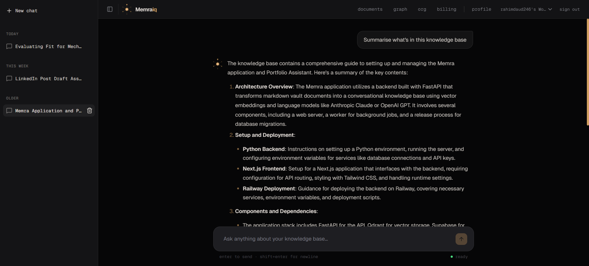
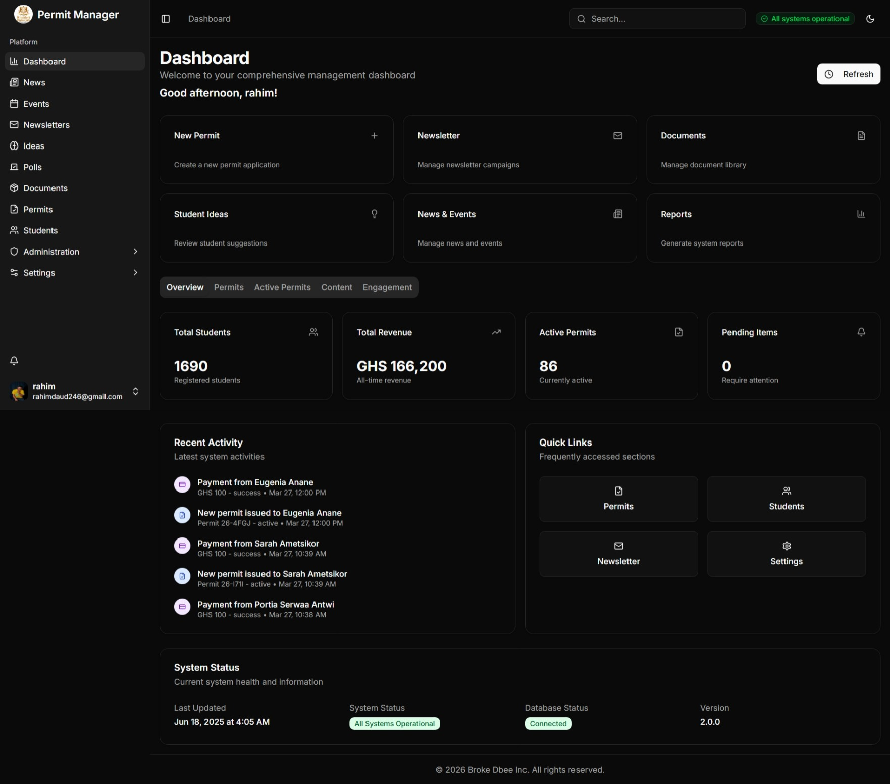
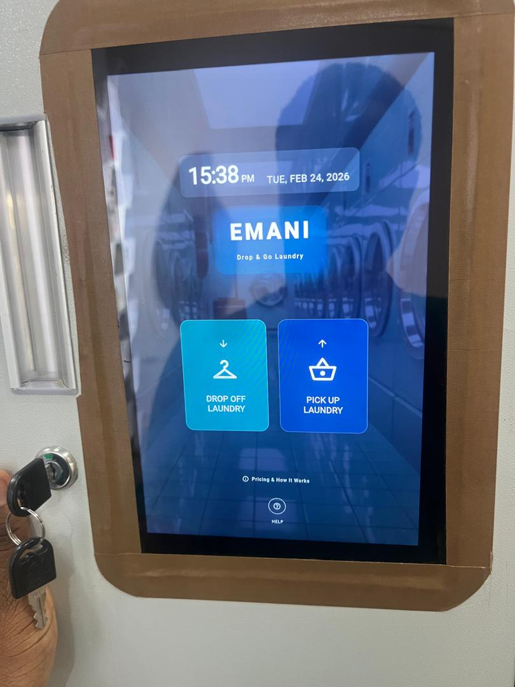
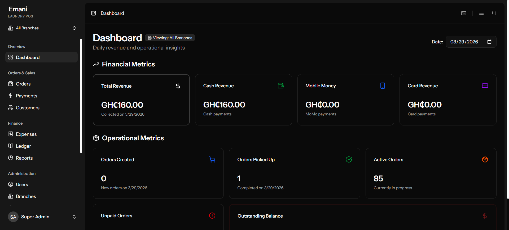
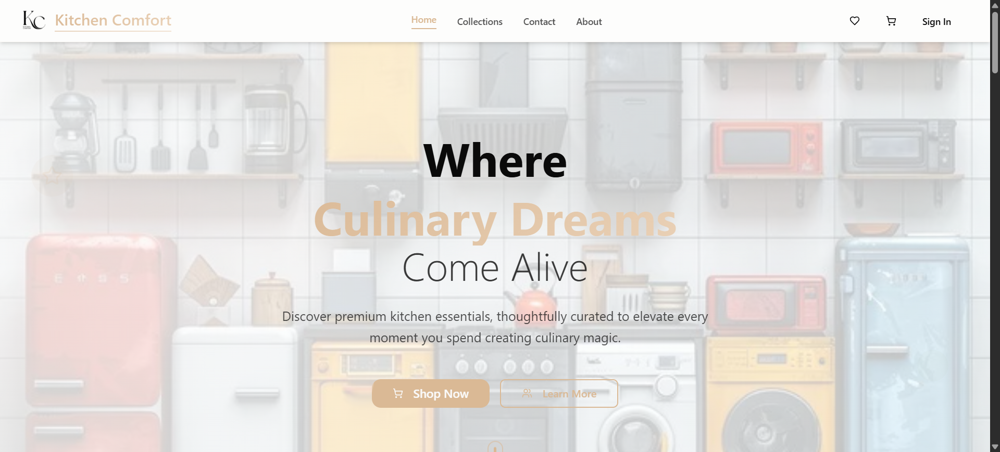
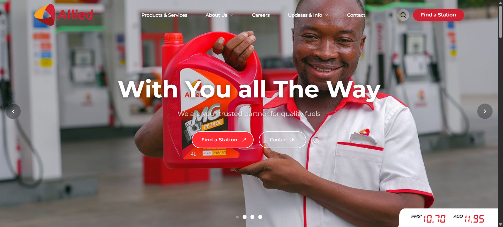

# Hi, I'm Piccolo

## Full-stack engineer | AI systems | IoT builder

Developer based in Accra, Ghana. I build full-stack systems end to end: backend, deployment, payments, AI pipelines, hardware. The kind that stay running.

**Quick links:** [Memraiq](https://memraiq.com) · [Memraiq app](https://app.memraiq.com) · [Kitchen Comfort](https://kitchen-comfort.com) · [KGL Group](https://kglgroup.com.gh) · [Allied Ghana](https://alliedghana.com) · [Portfolio vault](https://github.com/piccolojnr/portfolio-vault) · [LinkedIn](https://linkedin.com/in/rahim-daud-piccolo)

---

## What I do

- Full-stack web apps (Next.js, Laravel, FastAPI)
- AI systems (RAG pipelines, vector search, LLM integrations)
- IoT + hardware integrations
- SaaS platforms & internal tools
- Payments & real-world systems (Paystack, ExpressPay)

---

## Featured projects

Each project has a full case study in this repo (`overview.md` — problem, build, stack, results, lessons). Live links are included where the product is public. Screenshots, video, and other files sit in each project's `artifacts/` folder next to `overview.md`.

---

### Memraiq — AI knowledge retrieval platform

AI SaaS for querying personal knowledge using a custom RAG pipeline (not just wrappers).

- Built multi-service architecture (frontend, API, RAG engine)
- Replaced third-party RAG with custom pipeline
- Hybrid retrieval (vector + structured + graph)

**Live:** [memraiq.com](https://memraiq.com) · [app.memraiq.com](https://app.memraiq.com) (sign-up)
**Read more:** [Full case study →](./02_projects/memraiq/overview.md)

---

### SRC permit system — production platform

University system used by 1,687 students, processing 165,100+ GHS

- Full auth + payment flow
- Migration from Paystack to ExpressPay on a live system
- Role-based system with real usage

**Live:** Restricted to students during exam periods (no public URL)
**Read more:** [Full case study →](./02_projects/src-permit-system/overview.md)

---

### Smart laundry kiosk — IoT + software

End-to-end system controlling 16 physical lockers

- Hardware integration (TCP/IP controller)
- Flutter kiosk app
- Backend + admin dashboard
- OTP + payment system

**Live:** Working prototype (public deployment pending)
**Read more:** [Full case study →](./02_projects/laundry-kiosk/overview.md)

---

### Laundry POS — business system

Multi-branch POS system with:

- Partial payments
- WhatsApp / SMS / Email notifications
- Real client deployment

**Live:** Client deployment (confidential)
**Read more:** [Full case study →](./02_projects/laundry-pos/overview.md)

---

### Kitchen Comfort — e-commerce platform

- 62 products
- 45+ orders processed
- Admin dashboard + payment integration

**Live:** [kitchen-comfort.com](https://kitchen-comfort.com)
**Read more:** [Full case study →](./02_projects/kitchen-comfort/overview.md)

---

### Corporate websites (KGL + Allied Ghana)

Built for real companies in Ghana:

- CMS-powered (Sanity)
- Multi-page corporate architecture
- Delivered through long client cycles

**Live:** [KGL Group](https://kglgroup.com.gh) · [Allied Ghana](https://alliedghana.com)
**Read more:** [Allied Ghana →](./02_projects/allied-ghana-website/overview.md) · [KGL Group →](./02_projects/kgl-group-website/overview.md)

---

### CSIR noise dashboard — IoT system

Real-time IoT dashboard using MQTT:

- Live sensor data
- Map clustering
- Government research project

**Live:** Internal CSIR deployment (not public)
**Read more:** [Full case study →](./02_projects/csir-noise-dashboard/overview.md)

---

## Portfolio vault

All project documentation also lives in the separate vault repo:

[github.com/piccolojnr/portfolio-vault](https://github.com/piccolojnr/portfolio-vault)

Each project includes:

- Problem
- What I built
- How I built it
- Results & impact
- Lessons learned

---

## Tech stack

**Frontend**

- Next.js, React, Tailwind

**Backend**

- Laravel, FastAPI, NestJS

**AI**

- RAG pipelines
- Qdrant, Neo4j
- OpenAI / Anthropic

**Infra**

- Vercel, Railway, VPS
- Nginx, Docker

---

## Highlights

- 12+ projects shipped
- Real paying clients
- Systems handling real money + users
- Built across web, AI, and IoT

---

## Contact

- **LinkedIn:** [linkedin.com/in/rahim-daud-piccolo](https://linkedin.com/in/rahim-daud-piccolo)
- **Email:** rahimdaud24@gmail.com
- **GitHub:** [github.com/piccolojnr](https://github.com/piccolojnr)
- **Location:** Accra, Ghana
